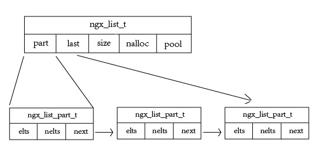

 * list
 * queue
 * array
 * hash
 * buf
 * file
 
####1、list--链表

**定义所在路径**:
`/src/core/ngx_list.h`、`/src/core/ngx_list.c`

**中心思想**：
采用了分组的方式实现链表。由于链表是动态数据结构，数据的数量是非固定的，所以采取的实现要有具备添加任意个数据项的能力。

**图解**：

**定义的结构**：   

	 ngx_list_part_s
	 ngx_list_part_t
	 ngx_list_t

**定义**：

	typedef struct ngx_list_part_s  ngx_list_part_t;

	struct ngx_list_part_s {
    	void             *elts;    //该分组第一个数据项地址
    	ngx_uint_t        nelts;   //该分组已经有多少项
    	ngx_list_part_t  *next;    //下一个分组
	};

	typedef struct {
    	ngx_list_part_t  *last;     //最后一个分组的地址
    	ngx_list_part_t   part;     //第一个分组
    	size_t            size;     //每个数据项的内存空间大小
    	ngx_uint_t        nalloc;   //每一个分组可以容纳的数据项
    	ngx_pool_t       *pool;     //内存池对象，分组的内存有该池管理
	} ngx_list_t;

**定义的函数**
	
	//创建一个链表
	ngx_list_t *ngx_list_create(ngx_pool_t *pool, ngx_uint_t n, size_t size);
	
	//往链表中添加一个数据项
	void *ngx_list_push(ngx_list_t *list);
	
	//链表初始化（静态内联函数）
	//static ngx_inline ngx_int_t ngx_list_init(ngx_list_t *list, ngx_pool_t *pool, ngx_uint_t n, size_t size);
	
	
####2、queue--双向链表

**定义所在路径**:
`/src/core/ngx_queue.h`、`/src/core/ngx_queue.c`

**中心思想**：
nginx定义的双向链表的结构很简单，就是一个包含前后指针的结构体。与链表截然不同的是双向链表并不负责数据元素的内存分配。

**图解**：
无

**定义的结构**：
   
	typedef struct ngx_queue_s  ngx_queue_t;

**定义**：

	struct ngx_queue_s {
    	ngx_queue_t  *prev;
    	ngx_queue_t  *next;
	};

**定义的函数(或者宏)**
	
	//初始化
	ngx_queue_init(q) 
	
	//判断是否为空                                                    
	ngx_queue_empty(h)  
	 
	//在双向链表h头部插入x元素                                                  
	ngx_queue_insert_head(h, x)  
	 
	//同 ngx_queue_insert_head(h, x)                                          
	ngx_queue_insert_after  

    //在双向链表h尾部插入x元素
	ngx_queue_insert_tail(h, x) 
	      
	//返回双向链表h首元素                                    
	ngx_queue_head(h) 
	
	//返回双向链表h最后一个元素                                                    
	ngx_queue_last(h)
	
	//返回双向链表h头部                       
	ngx_queue_sentinel(h)  
	
	//返回q的下一个元素                                              
	ngx_queue_next(q)
	
	//返回q的前一个元素                                               
	ngx_queue_prev(q)
	
	//将x从双向链表中删除                                                     
	ngx_queue_remove(x)
	
	//以q为界限（不包含q）拆分h链表，前半部分为h，后半部分为n。其中q为h链表的一个元素                                                
	ngx_queue_split(h, q, n)
	
	//合并h,n两个双向链表                                              
	ngx_queue_add(h, n)
	
	//返回q所在结构体的地址                                                   
	ngx_queue_data(q, type, link)                                         
	
	//返回双向链表的中心元素，若有N个元素，将返回第(N/2+1)个元素。
	ngx_queue_t *ngx_queue_middle(ngx_queue_t *queue);
	
	//对双向链表排序
	void ngx_queue_sort(ngx_queue_t *queue, ngx_int_t (*cmp)(const ngx_queue_t *, const ngx_queue_t *));
	
	
**解释**

1.  ngx_queue_data(q, type, link) 
	
	这是定义于`/src/core/ngx_queue.h`的宏，具体内容:
	 
	 	#define ngx_queue_data(q, type, link)   (type *) ((u_char *) q - offsetof(type, link))  
	 
	`offsetof(type,link)`函数返回type类型中link成员的地址偏移量。
	
	例子：
	
		struct Node{
			u_char* str;
			ngx_queue_t qElem;
			ngx_int_t num;
		}Node
		
		Node node;
		ngx_queue_t queue=node.qElem;
		
		//np == &node
		Node * np = ngx_queue_data(queue, Node, qElem)
	                                     
                                                
2. void ngx_queue_sort(ngx_queue_t *queue, ngx_int_t (*cmp)(const ngx_queue_t *, const ngx_queue_t *));
   
   对双向链表queue排序，采用的是插入排序算法，实现在`/src/core/ngx_queue.c`。
   参数`cmp`要自己实现。
   
   例子：
   		
   		ngx_int_t compare(const ngx_queue_t * que_a, const ngx_queue_t * que_b){
   			
   			Node * node_a=ngx_queue_data(que_a, Node, qElem);
   			Node * node_b=ngx_queue_data(que_b, Node, qElem);
   			return (node_a->num > node_b->num)
   			
   		}
   		
   		//将对queue做升序排序
   		ngx_queue_sort(&queue,compare);
	

