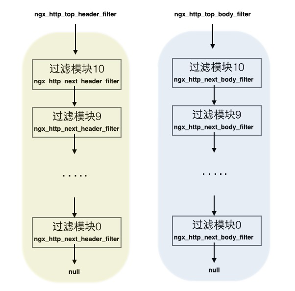

假设你需要对nginx返回的内容做进一步的处理，如返回的内容是文本文件，你需要在文件的头部插入特定的字符串，或者你希望返回的内容是压缩过的。这些都可以通过nginx的过滤模块来实现的。nginx自身就实现了多个过滤模块，也允许开发着开发自己的过滤模块。

###多个过滤模块是如何组织在一起的

有2种类型的过滤模块：头部过滤(head)，响应体过滤(body)，分别对应处理http响应的head和body。

nginx可以有多个过滤模块，一个过滤模块处理完之后，就会把处理的结果传给下一个过滤模块，和工厂的流水线有点类似。那多个过滤模块是如何串联成流水线形式的呢？答案是链表。

链表是通过2个特殊变量来实现的，首先有个全局top变量(ngx_http.h文件中定义),指向第一个过滤模块：
	
	extern ngx_http_output_header_filter_pt  ngx_http_top_header_filter;   //指向第一个head过滤模块
	extern ngx_http_output_body_filter_pt    ngx_http_top_body_filter;     //指向第一个body过滤模块

然后，在每一个过滤模块中，必须实现一个next变量，用来指向下一个过滤模块，如在一个模块中需要这样声明该变量:

	static ngx_http_output_header_filter_pt  ngx_http_next_header_filter;  //指向下一个head过滤模块
	static ngx_http_output_body_filter_pt    ngx_http_next_body_filter;    //指向下一个body过滤模块

next变量的存储类型是静态的，表明该变量只能在该模块所在的文件中修改，确保过滤模块的链表是顺序唯一的。

top变量和next变量都是指针类型，指向了某个函数，该函数用来实现过滤模块真正要做的内容，过滤模块大部分的工作都是实现该函数。`ngx_http_output_header_filter_pt`和`ngx_http_output_body_filter_pt`在ngx_http_core_module.h的定义如下：

	typedef ngx_int_t (*ngx_http_output_header_filter_pt)(ngx_http_request_t *r);
	typedef ngx_int_t (*ngx_http_output_body_filter_pt)(ngx_http_request_t *r, ngx_chain_t *chain);

需要在nginx启动的某个时刻设置好过滤模块的链表，通常的做法是在模块上写文结构体的postconfiguration域设置，如nginx的gunzip过滤模块的实现：

	static ngx_http_module_t  ngx_http_gunzip_filter_module_ctx = {
    	NULL,                                  /* preconfiguration */
    	ngx_http_gunzip_filter_init,           /* postconfiguration */

    	NULL,                                  /* create main configuration */
    	NULL,                                  /* init main configuration */

   		NULL,                                  /* create server configuration */
    	NULL,                                  /* merge server configuration */

    	ngx_http_gunzip_create_conf,           /* create location configuration */
    	ngx_http_gunzip_merge_conf             /* merge location configuration */
	};
	
	
gunzip模块在某处定义了next变量：

	static ngx_http_output_header_filter_pt  ngx_http_next_header_filter;
	static ngx_http_output_body_filter_pt    ngx_http_next_body_filter;

nginx在获取到相应模块的配置后会调用ngx_http_gunzip_filter_init来初始化定义的模块,看看gunzip过滤模块在ngx_http_gunzip_filter_init函数干了什么：

	static ngx_int_t ngx_http_gunzip_filter_init(ngx_conf_t *cf)
	{
    	ngx_http_next_header_filter = ngx_http_top_header_filter;
    	ngx_http_top_header_filter = ngx_http_gunzip_header_filter;

    	ngx_http_next_body_filter = ngx_http_top_body_filter;
    	ngx_http_top_body_filter = ngx_http_gunzip_body_filter;

    	return NGX_OK;
	}
	
可以看到，上面的函数就是用来设置过滤链表的，把过滤模块的处理方法插入到整个过滤链表的首部，所以过滤模块的处理顺序是逆序的，插入链表的时机越早，处理的时机就越晚。

###过滤模块是如何介入http处理的

在获取到用户请求的资源之后，需要发送响应给用户，这时可以通过`ngx_http_send_header`方法发送响应头给客户，通过`ngx_http_output_filter`方法发生响应体。

#####ngx_http_send_header的实现
该函数在`ngx_http.c`文件中定义：
	
	ngx_int_t ngx_http_send_header(ngx_http_request_t *r);

在`ngx_http.core_module.c`文件中实现:

	ngx_int_t
	ngx_http_send_header(ngx_http_request_t *r)
	{
		//判断头部是否已发送
    	if (r->header_sent) {
        	ngx_log_error(NGX_LOG_ALERT, r->connection->log, 0,
                      "header already sent");
        	return NGX_ERROR;
    	}
		//设定错误码
    	if (r->err_status) {
        	r->headers_out.status = r->err_status;
        	r->headers_out.status_line.len = 0;
    	}
		//调用第一个head过滤模块
    	return ngx_http_top_header_filter(r);
	}
	
#####ngx_http_output_filter的实现

该函数在`ngx_http.core_module.h`文件中定义：
	
	ngx_int_t ngx_http_output_filter(ngx_http_request_t *r, ngx_chain_t *chain);

在`ngx_http.core_module.c`文件中实现:

	ngx_int_t
	ngx_http_output_filter(ngx_http_request_t *r, ngx_chain_t *in)
	{
    	ngx_int_t          rc;
    	ngx_connection_t  *c;

    	c = r->connection;

    	ngx_log_debug2(NGX_LOG_DEBUG_HTTP, c->log, 0,
                   "http output filter \"%V?%V\"", &r->uri, &r->args);

    	rc = ngx_http_top_body_filter(r, in);
		
		//调用第一个body过滤模块
    	if (rc == NGX_ERROR) {
        	/* NGX_ERROR may be returned by any filter */
        	c->error = 1;
    	}

    	return rc;
	}
	
通过上面2个发送响应的函数可以看到，发送响应的函数会调用第一个过滤模块的处理方法，然后每一个过滤模块需要调用下一个过滤模块，这样就可以实现过滤模块的流水线处理。

###如何决定过滤模块的处理顺序

各个过滤模块的处理顺序是非常重要的，不同的处理顺序可能导致不同的响应结果，例如在一个处理图片的应用中，先改变图片的尺寸再加水印，和先加水印再改变尺寸的结果明显是不一样的。那nginx过滤模块的顺序是如何决定和修改呢？

nginx提供了2个shell脚本来做这个工作：configure和auto/modules。我们直接调用configure来配置nginx，configure会调用auto/modules，所以我们不需要自己调用auto/modules。

auto/modules脚本关于过滤模块的部分：
	
	# the filter order is important
	#     ngx_http_write_filter
	#     ngx_http_header_filter
	#     ngx_http_chunked_filter
	#     ngx_http_spdy_filter
	#     ngx_http_range_header_filter
	#     ngx_http_gzip_filter
	#     ngx_http_postpone_filter
	#     ngx_http_ssi_filter
	#     ngx_http_charset_filter
	#         ngx_http_xslt_filter
	#         ngx_http_image_filter
	#         ngx_http_sub_filter
	#         ngx_http_addition_filter
	#         ngx_http_gunzip_filter
	#         ngx_http_userid_filter
	#         ngx_http_headers_filter
	#     ngx_http_copy_filter
	#     ngx_http_range_body_filter
	#     ngx_http_not_modified_filter

	HTTP_FILTER_MODULES="$HTTP_WRITE_FILTER_MODULE \
                     	$HTTP_HEADER_FILTER_MODULE \
                     	$HTTP_CHUNKED_FILTER_MODULE"

	if [ $HTTP_SPDY = YES ]; then
    	HTTP_FILTER_MODULES="$HTTP_FILTER_MODULES $HTTP_SPDY_FILTER_MODULE"
	fi

	HTTP_FILTER_MODULES="$HTTP_FILTER_MODULES $HTTP_RANGE_HEADER_FILTER_MODULE"

	if [ $HTTP_GZIP = YES ]; then
    	have=NGX_HTTP_GZIP . auto/have
    	USE_ZLIB=YES
    	HTTP_FILTER_MODULES="$HTTP_FILTER_MODULES $HTTP_GZIP_FILTER_MODULE"
    	HTTP_SRCS="$HTTP_SRCS $HTTP_GZIP_SRCS"
	fi

	if [ $HTTP_POSTPONE = YES ]; then
    	HTTP_FILTER_MODULES="$HTTP_FILTER_MODULES $HTTP_POSTPONE_FILTER_MODULE"
    	HTTP_SRCS="$HTTP_SRCS $HTTP_POSTPONE_FILTER_SRCS"
	fi

	if [ $HTTP_SSI = YES ]; then
    	have=NGX_HTTP_SSI . auto/have
    	HTTP_FILTER_MODULES="$HTTP_FILTER_MODULES $HTTP_SSI_FILTER_MODULE"
    	HTTP_DEPS="$HTTP_DEPS $HTTP_SSI_DEPS"
    	HTTP_SRCS="$HTTP_SRCS $HTTP_SSI_SRCS"
	fi

	if [ $HTTP_CHARSET = YES ]; then
    	HTTP_FILTER_MODULES="$HTTP_FILTER_MODULES $HTTP_CHARSET_FILTER_MODULE"
    	HTTP_SRCS="$HTTP_SRCS $HTTP_CHARSET_SRCS"
	fi

	if [ $HTTP_XSLT = YES ]; then
    	USE_LIBXSLT=YES
    	HTTP_FILTER_MODULES="$HTTP_FILTER_MODULES $HTTP_XSLT_FILTER_MODULE"
    	HTTP_SRCS="$HTTP_SRCS $HTTP_XSLT_SRCS"
	fi

	if [ $HTTP_IMAGE_FILTER = YES ]; then
    	USE_LIBGD=YES
    	HTTP_FILTER_MODULES="$HTTP_FILTER_MODULES $HTTP_IMAGE_FILTER_MODULE"
    	HTTP_SRCS="$HTTP_SRCS $HTTP_IMAGE_SRCS"
	fi

	if [ $HTTP_SUB = YES ]; then
    	HTTP_FILTER_MODULES="$HTTP_FILTER_MODULES $HTTP_SUB_FILTER_MODULE"
    	HTTP_SRCS="$HTTP_SRCS $HTTP_SUB_SRCS"
	fi

	if [ $HTTP_ADDITION = YES ]; then
    	HTTP_FILTER_MODULES="$HTTP_FILTER_MODULES $HTTP_ADDITION_FILTER_MODULE"
    	HTTP_SRCS="$HTTP_SRCS $HTTP_ADDITION_SRCS"
	fi

	if [ $HTTP_GUNZIP = YES ]; then
    	have=NGX_HTTP_GZIP . auto/have
    	USE_ZLIB=YES
    	HTTP_FILTER_MODULES="$HTTP_FILTER_MODULES $HTTP_GUNZIP_FILTER_MODULE"
    	HTTP_SRCS="$HTTP_SRCS $HTTP_GUNZIP_SRCS"
	fi

	if [ $HTTP_USERID = YES ]; then
		HTTP_FILTER_MODULES="$HTTP_FILTER_MODULES $HTTP_USERID_FILTER_MODULE"
    	HTTP_SRCS="$HTTP_SRCS $HTTP_USERID_SRCS"
	fi

在auto/modules脚本里面会添加一些nginx默认的过滤模块。在调用configure脚本的时候可以通过--add-module参数来添加过滤模块，之后auto/modules会把添加的模块插入链表中。

	if [ $HTTP = YES ]; then
    	modules="$modules $HTTP_MODULES $HTTP_FILTER_MODULES \
             	$HTTP_HEADERS_FILTER_MODULE \
             	$HTTP_AUX_FILTER_MODULES \
             	$HTTP_COPY_FILTER_MODULE \
             	$HTTP_RANGE_BODY_FILTER_MODULE \
             	$"
	HTTP_NOT_MODIFIED_FILTER_MODULE
    	NGX_ADDON_DEPS="$NGX_ADDON_DEPS \$(HTTP_DEPS)"
	fi
	
	
	
通过上面的脚本分析，可以得到所有过滤模块的顺序如下，（默认情况下，具体得依赖安装nginx时配置）：
	
	HTTP_NOT_MODIFIED_FILTER_MODULE,
	HTTP_RANGE_BODY_FILTER_MODULE,
	HTTP_COPY_FILTER_MODULE,
	HTTP_HEADERS_FILTER_MODULE,
	第三方过滤模块,
	HTTP_USERID_FILTER_MODULE,
	HTTP_CHARSET_FILTER_MODULE,
	HTTP_SSI_FILTER_MODULE,
	HTTP_POSTPONE_FILTER_MODULE,
	HTTP_GZIP_FILTER_MODULE,
	HTTP_RANGE_HEADER_FILTER_MODULE,
	HTTP_CHUNKED_FILTER_MODULE,,
	HTTP_HEADER_FILTER_MODULE,
	HTTP_WRITE_FILTER_MODULE
	
configure脚本运行的过程中会把所有的模块输出到objs/ngx_modules.c文件中，文件中的各个模块顺序就是nginx处理http请求时的顺序。所以修改各个模块的处理顺序有2种方式，一种是直接留给configure脚本，二是修改objs/ngx_modules.c文件中各个模块的顺序。
	