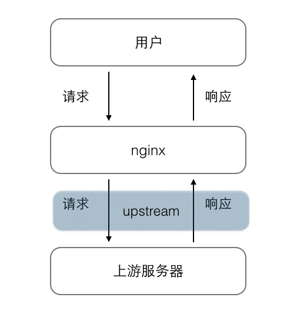
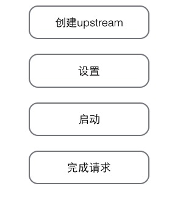
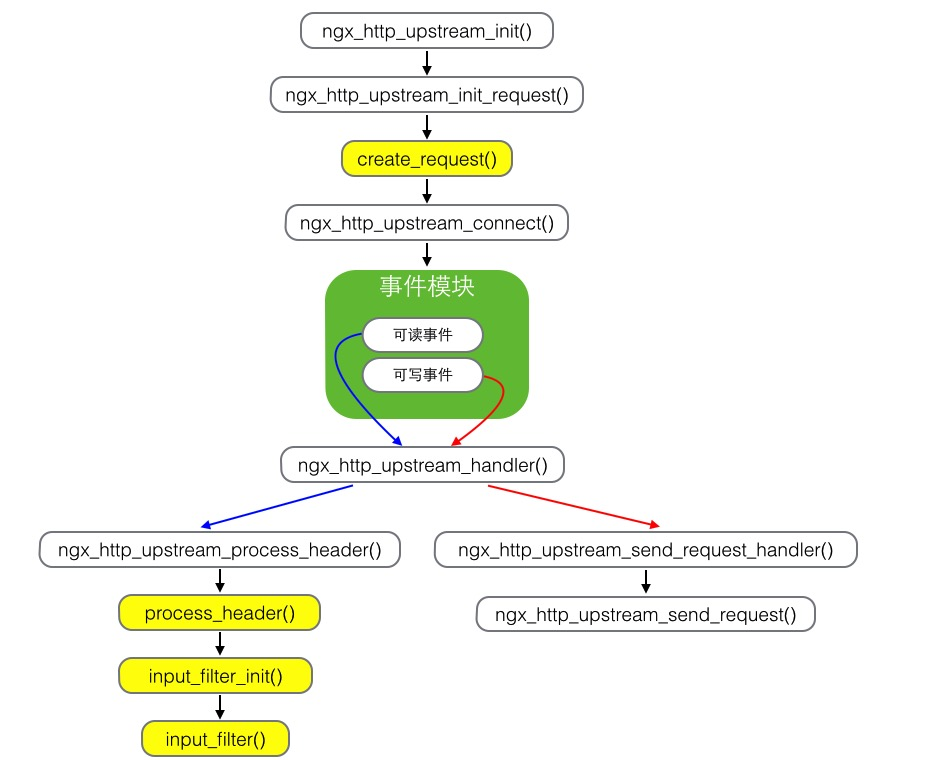

nginx是一款优秀的反向代理服务器，其代理功能是通过upstream机制来实现的，upstream是http框架的一部分。upstream使得nginx具有访问上游服务器的能力，并且可以通过组建集群来实现对上游服务器的负载均衡。

访问上游服务器的过程与普通的http请求是一致的，不同的是普通的请求是用户连接到nginx服务器，而访问上游服务器是nginx连接到上游服务器。既然如此，那upstream就需要解决2个基本的问题：

1. 与上游服务器建立连接，并发送用户请求到上游服务器。
2. 将上游服务器的响应转发给用户。

###upstream

	struct ngx_http_request_s {
		...
    	ngx_http_upstream_t              *upstream;
		...
	}
	
nginx接收的每一个请求都由一个ngx_http_request_t结构表示，在该结构中有一个upstream值用来实现upstream，这代表了每一个来自用户的请求都有能力访问上游服务器。在不需要访问上游服务器时，upstream的值为空，反之，则只需要创建upstream，设置upstream的回调方法，并调用upstream提供的启动方法就可以访问上游服务器了。这时候，处理http请求的各个模块阶段处理方法将失效，所有的处理将交给upstream调用设置好的回调来完成。

####创建upstream

upstream提供了创建upstream的方法，传入request参数，直接调用就可以了。

	ngx_int_t ngx_http_upstream_create(ngx_http_request_t *r)
	
####设置upstream

这一步是访问上游服务器至关重要的一步，启动以及启动之后的所有事件处理都依赖upstream的设置，如果设置不当会使得访问失败。

	struct ngx_http_upstream_s {
    	ngx_http_upstream_handler_pt     read_event_handler;
    	ngx_http_upstream_handler_pt     write_event_handler;

    	ngx_peer_connection_t            peer;

    	ngx_event_pipe_t                *pipe;

    	ngx_chain_t                     *request_bufs;

    	ngx_output_chain_ctx_t           output;
    	ngx_chain_writer_ctx_t           writer;

    	ngx_http_upstream_conf_t        *conf;

    	ngx_http_upstream_headers_in_t   headers_in;

    	ngx_http_upstream_resolved_t    *resolved;

    	ngx_buf_t                        from_client;

    	ngx_buf_t                        buffer;
    	off_t                            length;

    	ngx_chain_t                     *out_bufs;
    	ngx_chain_t                     *busy_bufs;
    	ngx_chain_t                     *free_bufs;

    	ngx_int_t                      (*input_filter_init)(void *data);
    	ngx_int_t                      (*input_filter)(void *data, ssize_t bytes);
    	void                            *input_filter_ctx;

	#if (NGX_HTTP_CACHE)
    	ngx_int_t                      (*create_key)(ngx_http_request_t *r);
	#endif
    	ngx_int_t                      (*create_request)(ngx_http_request_t *r);
    	ngx_int_t                      (*reinit_request)(ngx_http_request_t *r);
    	ngx_int_t                      (*process_header)(ngx_http_request_t *r);
    	void                           (*abort_request)(ngx_http_request_t *r);
    	void                           (*finalize_request)(ngx_http_request_t *r,
                                         ngx_int_t rc);
    	ngx_int_t                      (*rewrite_redirect)(ngx_http_request_t *r,
                                         ngx_table_elt_t *h, size_t prefix);
    	ngx_int_t                      (*rewrite_cookie)(ngx_http_request_t *r,
                                         ngx_table_elt_t *h);

    	ngx_msec_t                       timeout;

    	ngx_http_upstream_state_t       *state;

    	ngx_str_t                        method;
    	ngx_str_t                        schema;
    	ngx_str_t                        uri;

    	ngx_http_cleanup_pt             *cleanup;

    	unsigned                         store:1;
    	unsigned                         cacheable:1;
    	unsigned                         accel:1;
    	unsigned                         ssl:1;
	#if (NGX_HTTP_CACHE)
    	unsigned                         cache_status:3;
	#endif

    	unsigned                         buffering:1;
    	unsigned                         keepalive:1;
    	unsigned                         upgrade:1;

    	unsigned                         request_sent:1;
    	unsigned                         header_sent:1;
	};
	
	
最重要的设置有2个，8个回调方法和ngx_http_upstream_conf_t类型的配置conf。

upstream通过回调方法来与上游服务器交互，upstream提供了8个回调方法，除了3个必须要实现外，其他的可以根据需要来实现。

1. create_request
2. process_header
3. finalize_request
4. reinit_request
5. rewrite_redirect
6. rewrite_cookie 
7. input_filter_init
8. input_filter

#####create_request

ngx_http_upstream_conf_t结构的request_bufs域保存了所有需要发送到上游服务器的请求内容，create_request回调方法的主要作用就是设置request_bufs的值。发送给上游服务器的请求内容不能为空，所以create_request回调是必须实现的。

#####process_header

process_header用于解析上游服务器返回的响应头部信息，在响应信息返回时触发。该方法有可能被调用多次，直到响应头部被解析完毕。
nginx将接受到上游服务器的响应内容存放到r-upstream->buffer指向的内存中，所以process_header是对buffer的内容进行解析。

#####finalize_request

finalize_request会在结束请求的时候调用，用来做结尾工作，如释放创建的资源等。这个回调是必须实现的，即使没有创建什么资源。

#####reinit_request

从回调的名字上可以看出这个方法的作用就是重新连接上游服务器，在连接上游服务器的时候，可能由于异常出现导致连接失败，那么upstream就会根据配置来调用reinit_request来尝试重新连接服务器。如果不需要则可以将此值设置为空，那么upstream就不会处理这步骤。

#####rewrite_redirect

若上游服务器返回的响应头部中有location或者refresh域时，ngx_http_upstream_process_headers方法
则会调用ngx_http_upstream_rewrite_location来调用rewrite_redirect回调。

#####rewrite_cookie

若上游服务器返回的响应头部中有Cookie域时，ngx_http_upstream_process_headers方法
则会调用ngx_http_upstream_rewrite_set_cookie来调用rewrite_cookie回调。

#####input_filter_init与input_filter

这两个方法都用来处理来自上游服务器的响应体。在处理响应体之前可能需要做一些初始化的工作，如分配一些内存来存储一些中间状态等，input_filter_init就是用来完成这些任务的，而input_filter是真正处理响应体的方法。这两个回调方法可以不实现，upstream设置默认的处理响应体方法。

upstream提供了3种处理上游服务器返回的响应包的方式，包括由开发者实现的input_filter回调处理、以固定缓冲区转发、不固定缓冲区加文件的方式转发。

除了设置好回调函数之后，还需要设置一些控制upstream连接的参数，如连接超时时间、接收响应的内存大小等，这些都是设置在r->upstream->conf参数中。

	typedef struct {
    	ngx_http_upstream_srv_conf_t    *upstream;

    	ngx_msec_t                       connect_timeout;
    	ngx_msec_t                       send_timeout;
    	ngx_msec_t                       read_timeout;
    	ngx_msec_t                       timeout;

    	size_t                           send_lowat;
    	size_t                           buffer_size;

    	size_t                           busy_buffers_size;
    	size_t                           max_temp_file_size;
    	size_t                           temp_file_write_size;

    	size_t                           busy_buffers_size_conf;
    	size_t                           max_temp_file_size_conf;
    	size_t                           temp_file_write_size_conf;

    	ngx_bufs_t                       bufs;

    	ngx_uint_t                       ignore_headers;
    	ngx_uint_t                       next_upstream;
    	ngx_uint_t                       store_access;
    	ngx_flag_t                       buffering;
    	ngx_flag_t                       pass_request_headers;
    	ngx_flag_t                       pass_request_body;

    	ngx_flag_t                       ignore_client_abort;
    	ngx_flag_t                       intercept_errors;
    	ngx_flag_t                       cyclic_temp_file;

    	ngx_path_t                      *temp_path;

    	ngx_hash_t                       hide_headers_hash;
    	ngx_array_t                     *hide_headers;
    	ngx_array_t                     *pass_headers;

    	ngx_http_upstream_local_t       *local;

	#if (NGX_HTTP_CACHE)
    	ngx_shm_zone_t                  *cache;

    	ngx_uint_t                       cache_min_uses;
    	ngx_uint_t                       cache_use_stale;
    	ngx_uint_t                       cache_methods;

    	ngx_flag_t                       cache_lock;
    	ngx_msec_t                       cache_lock_timeout;

    	ngx_flag_t                       cache_revalidate;

    	ngx_array_t                     *cache_valid;
    	ngx_array_t                     *cache_bypass;
    	ngx_array_t                     *no_cache;
	#endif

    	ngx_array_t                     *store_lengths;
    	ngx_array_t                     *store_values;

    	signed                           store:2;
    	unsigned                         intercept_404:1;
    	unsigned                         change_buffering:1;

	#if (NGX_HTTP_SSL)
    	ngx_ssl_t                       *ssl;
    	ngx_flag_t                       ssl_session_reuse;
	#endif

    	ngx_str_t                        module;
	} ngx_http_upstream_conf_t;

connect_timeout、send_timeout、read_timeout分别表示连接超时、发送数据包超时、接收数据包超时的时间，是一定要设置的，因为默认值为0，如不设置将无法与上游服务器建立连接。

###启动upstream

在设置好所有需要设置的选项之后，就可以调用upstream提供的ngx_http_upstream_init()方法来启动upstream，然后upstream就会根据设置与上游服务器建立连接，并添加可读可写事件到事件模型中监听，在事件触发之后就调用相应的回调方法来处理。

其中，在upstream工作的各个阶段中，只要出现错误即会调用ngx_http_upstream_finalize_request()来终止连接。

